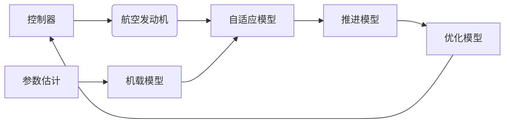

# 1、数字孪生初探

##  1.1 数字孪生的定义

数字孪生的定义[^1]：数字孪生模型被定义为一个三维模型，包括物理实体、数字实体及二者之间的连接。

## 1.2 数字孪生包含的要素

文献[^1]所述，航空发动机运维数字孪生模型包含：

1. 物理空间中的实际运行环境；
2. 发动机实体；
3. 数字空间中的数字环境和数字实体；   
4. 物理空间和数字空间的数据/信息双向交换。

更进一步地，物理空间包括（1）实际运行环境和（2）发动机实体。实际运行环境指飞行包线和飞机运行状态，发动机实体指包含控制系统的物理发动机本体。

数字空间包括（1）数字环境和（2）数字实体，是运行环境和发动机实体的数字孪生体。

物理空间向数字空间传递的数据包括（1）实时数据和（2）离线数据。实时数据指传感器数据，离线数据指历史飞行数据、出场数据、维修/故障数据等。

数字空间向物理空间传递的信息是包含行为指导意义的数据，是数字孪生体的行为特征。

## 1.3 航空发动机运维数字孪生体构建过程

1. 基于发动机原理采用模型驱动的方法构建初始模型；
2. 融合不同数据修正初始模型。

可实现如下功能：

1. 精准监测。将实时传感器数据与性能模型 结合，随运行环境变化和物理发动机性能的衰减，构建出的自适应模 型，可精准监测发动机的部件和整机性能。
2. 故障诊断。将历史维修数据中的故障模式注入三维物理模型和性能模型， 构建出故障模型，可应用于故障诊断和预测。
3. 性能预测。将历史飞行数据与性能 模型结合并融合数据驱动的方法，构建出性能预测模型，预测整机性能和剩余寿命。
4. 控制优化。将局部线性化模型与飞机运行状态环境模型融合并构建控制优化模型，可实现发动机控制性能寻优。

各功能作用：

1. 精准监测。解决发动机衰减后，模型无法实时准确估计整机性能参数的问题。
2. 故障诊断。将同批次发动机的维修、故障数据记录分析形成故障模式，注入到初始模型，在实际运行 中不断与发动机测量数据比较，提 取相似的故障模式预测故障。
3. 性能预测。可记录同批次发 动机的运行历史数据，融合基准模型进行性能预测。
4. 控制优化。解决了飞机和发 动机综合控制过程中发动机控制优 化的问题。

整个数字孪生构建过程如下：

# 2、航空发动机仿真技术的发展[^2]

## 2.1 学科领域仿真技术

包括：

（1）流体仿真。即计算流体力学。

（2）燃烧仿真。即计算燃烧学。

（3）传热仿真。即计算传热学。

（4）结构强度仿真。即计算结构力学，应用计算结构力学，计算从零件到部件、组件、分系统和整台发动机的结构性能。

（5）材料仿真。通过模拟材料的组成、结构、性能以及服役性能，研究材料各个尺度范围内存在的各类现象和特征。

## 2.2 产品结构层次仿真技术

（1）控制系统仿真。

（2）液压机械执行机构仿真。

（3）燃烧室仿真。

（4）压气机、涡轮等机构仿真。

# 3、航空发动机可靠性领域的应用探析[^3]

构建可靠性数字孪生包括4层：

1. 第一层：包括尺寸和公差等信息在内的发动机完整几何结构。
2. 第二层：在几何的基础上增加了每个零部件的材料特性。
3. 第三层：从零部件、系统到整机的发动机性能评估。
4. 第四层：对发动机故障的诊断及可靠性预测。

# 参考文献

[^1]: 刘魁,王潘,刘婷.数字孪生在航空发动机运行维护中的应用J.航空动力,2019,(04):70-74.
[^2]:  曹建国.航空发动机仿真技术研究现状、挑战和展望[J].推进技术,2018,39(05):961-970.
[^3]: 刘魁,刘婷,魏杰,等.数字孪生在航空发动机可靠性领域的应用探索[J].航空动力,2019,(04):61-64.
