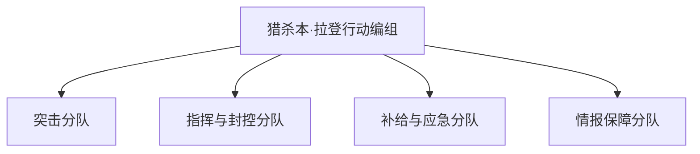
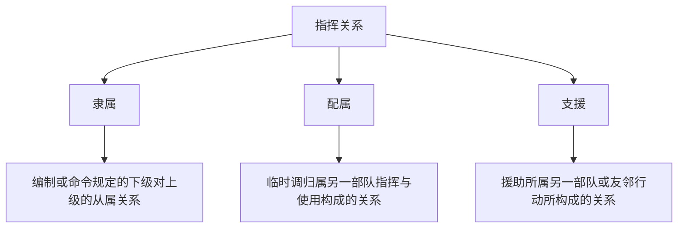

# 第1讲：概述

## 1 概念内涵

指挥控制(Command and Control，C2)的成效是战争胜负的决定因素，取得体系优势的关键在于指挥控制，战争中任何一项其他活动的重要程度都无法和指挥控制相提并论。

### 1.1 指挥控制的定义

- 中国：指挥员及其指挥机关对部队作战或其行动掌握和制约的活动。**强调指挥员与指挥机关的统一，以及对部队行动的掌控。**
- 美国：经授权的指挥官在执行使命过程中对配属人员行使职权，实施指导。**强调指挥员的职权，以及指挥员的权威。**
- 北约：经授权的指挥官对所分配的兵力行使其指挥与指导权力以完成赋予的使命。**强调权力以及完成使命任务。**

### 1.2 “指挥”与“控制”

- 指挥：解决的是作战当中评估判断、预测、构想、决策等问题，是一种创造性很强的活动。
- 控制：把决心变为现实、逐步实现目标的具体措施和过程，具有创造性，但更富事务性、规范性、程序性和可操作性。
- 如果把兵力比作**马**，指挥则比作**骑手**，控制则比作**挽具**。

### 1.3 相关概念

- 指挥：指挥员下达作战命令、决策和战术操作，包括指挥部队协调军事行动，确保任务的成功执行以及在战场上做出实时的决策等。
- 管理：规划、协调和监督资源和活动，以确保军队能够有效地执行任务并达到其目标。
- 组织：指部队的结构和构造，包括军队的层级、部门等。
- 领导：指在军队中具有权威和激励力的个体或团队，通过鼓励激励、示范和指导来引导他们的部下以实现共同的目标。

## 2 学习意义

### 2.1 学习目的

- 收获一套从观察判断到决策行动的理论框架。

  > 用于指导如何在动态变化条件下，带领团队高效完成使命任务。

- 收获一种军队指挥员的视角。

  > 可用于分析、认知不同领域中面向特定任务的团队组织与指挥领导的问题。

### 2.2 指挥控制的特点

与一般管理活动相比，指挥控制有以下三个特点：

- 群体性（体系性）：组织与组织的对抗，涵盖人、武器和系统，连接调用所有要素，涉及物理、信息、认知、社会等多域。
- 时效性：使命任务有严格的时效要求，必须在指定的时间内完成。
- 不确定性（对抗性）：面对动态变化的环境对手采取的争锋相对的行动。

### 2.3 课程定位

包括5个模块：

- 认识指挥控制：指挥控制的基本概念、主要只能、本质特征等。
- 如何进行组织：指挥控制的过程模型、指挥控制的模式、组织设计的要素与方法等。
- 如何认知态势：态势认知的概念、要素，态势认知相关的模型，从信息论、贝叶斯推断的角度理解态势认知。
- 如何高效决策：决策规划的概念、主要过程与内容，决策问题的分类与决策基本原理，从最优化、不确定性、博弈论等角度理解决策规划。
- 如何控制行动：行动控制的手段与方式，从反馈控制、自组织角度理解行动控制。

## 3 思考题

1. 请简述”指挥“与”控制“的关系。

> 指挥：
>
> - 上层的、宏观的定义。
> - 主要侧重于决策层面，通过对各种信息的综合分析和判断，制定作战任务、目标、战略方针等，为作战行动确定方向和目标，是一种创造性的活动，具有灵活性、策略性、艺术性，需要指挥员具备丰富的经验和卓越的指挥才能。
> - 比如说，指挥是在指挥所里，指挥员带着参谋来设计整个军事行动。
>
> 控制：
>
> - 下层的、微观的定义。
> - 侧重于执行层面，是对作战行动的实时管理和监控，更具事务性、规范性、程序性和可操作性，通过各种技术手段和管理措施，实现对作战行动的有效控制。
> - 比如说，发出指令后，调整整个行动与指挥目标一致的过程。
>
> 指挥与控制的关系：指挥与控制相互依存、相互制约，共同构成指挥控制系统的有机整体，指挥为控制提供目标和方向，控制为指挥提供执行保障和反馈依据，两者通过信息的不断交换和反馈，形成一个动态的闭环系统。比如说，因为不能完全设想行动中的外部变化，指挥需要根据控制过程中的反馈适时调整策略。

2. 请查阅资料找出其他国家对指挥控制的定义，它们的定义和中国的定义有什么异同？

> - **中国**：指挥员及其指挥机关对部队作战或其他行动进行掌握和制约的活动[^1]。
> - **美国**：
>   - 定义：经授权的指挥官在执行使命过程中对配属人员行使职权，实施指导[^2]。
>   - 异同：（1）相同点：都强调了指挥官在其中发挥的领导和决策作用，以及对作战任务的完成有明确的指向。（2）不同点：美国的定义更突出权威性，强调指挥官对部队行使权威和指导，注重自上而下的指挥层级和权力关系；而中国的定义强调指挥员及其指挥机关对部队作战或其他行动进行掌握和制约的活动。
> - **北约**：
>   - 定义：经授权的指挥官对所分配的兵力行使其指挥与指导权力以完成赋予的使命[^2]。
>   - 异同：（1）相同点：都认同指挥控制是指挥官对部队及其作战行动的指引和影响，目的是确保部队行动的协调一致，以达成作战目标。（2）不同点：北约的定义强调 “领导和影响”，比较注重指挥官的个人素质、领导魅力和决策能力等对部队的带动和感召作用，突出指挥官在战场态势理解和决策过程中的关键地位；而中国的定义更强调 “掌握和制约” 的过程，即通过一系列的手段和活动，如情报获取、指挥决策、兵力调配等，来实现对作战行动的有效管控，更侧重于整个指挥控制系统的运行和作用发挥。

3. 请举出几个工作生活中指挥控制的例子。

> 举办晚会，安排A、B、C人员做1、2、3件事情，叫做指挥。ABC人员分别在做123件事情时，实施的具体行动叫做控制。在这个过程中，根据实施行动的情况，反馈指挥人员，调整新的指挥策略，例如：事情1人手不够，需要调拨D、E人员援助，叫做指挥；A安排D、E人员做1-1、1-2件事情，叫做控制。

参考文献：

[^1]: 军事科学院.中国人民解放军军语[M]. 解放军战士出版社,1982.
[^2]: 孙强, 阳东升, 张维明. C2及其相关术语的理解与认识[J]. 火力与指挥控制, 2013, 38(12): 1-5+12.

# 第2讲：主要职能

## 1 概述

### 1.1 指挥员是做什么的

**态势认知**、**决策规划**、**行动控制**。三个核心功能相互关联、影响、支撑。

态势认知是基础，决策规划是作战体系的“大脑”，行动控制是“神经系统”。

指挥控制活动具体包括：

- 构造兵力编程
- 明确指挥控制关系
- 明确指挥编组

指挥控制主要职能：

- 组织设计：针对使命任务、战场环境和可用资源，建立指挥控制组织结构，明确任务分工与指挥控制关系，以有效完成使命任务。

  > 如战斗中的兵力编成、指挥编组，晚会、比赛等活动中的人员编组等。

- 态势认知：对战场状态和形势的认识，包括对战场态势元素的含义理解，以及对未来的改变进行预测，是指挥员对态势进行理解的过程。

  > 如中美博弈战略态势、抗击疫情态势等。

- 决策规划：在态势认知的基础上，确定意图、生成行动方案和计划，并对其效果、效率、代价、风险等进行评估的过程。目的是把有限的资源在正确的时间部署到正确的地点去执行正确的任务，**并在这一过程中实现预设目标的优化**。

  > 如诺曼底登陆中的战略决策与战术选择。

- 行动控制：对可用资源进行组织、协调、掌握、制约的活动，确保行动同步有序，保证行动目标、行动计划的完成。

  > 如人员调动、路线选择与调整等。

## 2 主要职能

### 2.1 态势认知

战场态势包括：敌、我、环境。

> 敌、我（作战态势）：作战各方部署和行动所形成的状态和形势，以及它们的变化发展趋势。
>
> 环境：战场环境的状态与变化发展趋势

> 此外，作战任务及其约束条件、时间与空间关系、机会与风险因素也是战场态势的重要组成部分。

态势有三个层面：

- 战略态势
- 战役态势
- 战术态势

### 2.2 决策规划

决策规划包括：作战决策、任务规划等。

（1）作战决策过程可以分为：筹划、计划两个过程。

- 筹划：从战争全局上进行的运筹谋划，生成决策的总体构想。“运筹帷幄之中决胜千里之外”，说的就是对军事谋略作通盘考虑和全面策划，可以决定千里之外的胜负。
- 计划：决策到行动的重要桥梁，是将作战决策进一步具体化，通盘考虑各参战力量的活动做出的具体安排。拿破仑指出“只有拟定出深思熟虑的计划，才有可能在战争中成功。”

（2）任务规划突出“筹划、计划”中的技术特性，强调过程的工程化、精确化和信息化，是作战决策的一种技术化体现。

### 2.3 行动控制

行动控制包括：作战目标控制、时机的控制、作战进程的控制、协同关系的控制。

- 作战目标控制：作战目标体现着作战行动所要达到的预定目的和企图。
- 时机的控制：是对战争时间、空间因素的充分把握与合理利用。
- 作战进程的控制：控制行动的节奏和速度，按作战计划完成特定作战任务
- 协同关系的控制：及时调整与各参战部队协同关系。

#### 2.3.1 基于计划的反馈式控制

上述流程图为基于计划的反馈式控制，符合控制论的经典思想。

> 例子：**诺曼底登陆**
> 盟军在行动前制定了详细的计划，但在执行过程中，他们不断根据天气、海况、敌方防御等实际情况进行反馈和调整。例如，面对德军的顽强抵抗，盟军不断调整登陆点和进攻策略，最终成功占领了诺曼底。

#### 2.3.2 基于任务的自主式控制

上述流程图为基于任务的自主式控制。强调下级指挥员在理解上级意图后，根据当前情况和可用资源，自我纠偏、自行同步，充分发挥一线自主性应对非预料情况。

> 例子：胡家窝棚战役
>
> - 东北野战军指挥部适时下放指挥权，向各纵队下达指示：**哪里有敌人就往哪里打，哪里有枪声就往哪里追。**
> - 在混战中，廖耀湘的指挥部被打散，导致其兵团失去指挥最终被围歼。廖耀湘将这次战斗描述为“第一棒就打碎了辽西兵团的脑袋”。

### 2.4 组织设计

- 指挥控制组织：由指挥员可调用的各类兵力资源、指挥控制节点等实体，为完成特定使命任务而形成的有机整体，通常具备与使命任务和环境相匹配的兵力编成和指挥关系。

- 兵力编成：指任务部队的兵力组织构成，包括组成的力量和编组形式任务部队是指遂行作战、战备、训练、演习、执勤、施工等任务的部（分）队。

  > 兵力编成需要充分考虑作战任务、作战环境、作战目的、兵力规模等多种因素，通过合理的组织与调配，形成高效、灵活的作战力量。

- 指挥关系：指挥关系明确了各级作战指挥机构之间、指挥与被指挥对象之间，按照指挥权限和职能划分的作用关系，是编制体制和指挥控制机制的综合体现。

- 指挥控制组织设计：面向任务，进行兵力编组和任务分配，同时设计各指挥节点及其权责，确定指挥关系，以高效完成任务。设计方法包括两类：
  - 自顶向下：基于最优化方法，进行任务分解，并确定最佳的兵力编组和指挥关系。
  - 自底向上：基于规则，通过边缘自组涌现形成。

## 3 思考题

1. 请简述指挥控制的主要职能。
2. 请查阅毛主席关于指挥员职责的原文，理解其含义。
3. 请举出几个工作生活中“控制”“协同”和“协调”的例子。

# 第3讲：本质特征

## 1 出发点

出发点：强对抗中的**不确定性**。

不确定的来源：环境、资源、对手。

> 战争是典型的开放复杂巨系统，具有不确定性的突出特点，是其本质属性，不能完全消除，也不能完全准确的进行预测。

> 例子：蟒蛇行动
> 美军动用了最先进的侦察手段，制定了详细的计划，但对敌情的误判恶劣天气、装备故障、机动延误、不可靠的卫星通信和敌我识别技术等情况，从始至终困扰着美军。
> “不确定性”并没有因为美军技术和装备先进而消失，也没有因为周密计划和预判而消除。

## 2 落脚点

落脚点：以**最小**的代价**高效**完成任务。

> 效果：作战效果、完成时间等。
>
> 代价：人员伤亡、物资消耗、附带损伤等。

> 例子：诺曼底登陆
>
> - 情报收集和分析：盟军战前收集了大量敌防御体系、地形、天气等方面情报，为决策提供了重要依据。
> - 指定作战计划：盟军指挥官在制定作战计划时考虑了多个因素，包括登陆地点、时间、兵力部署、火力支援等。他们利用情报分析和模拟演练制定了详细的战术方案以最大程度地减少伤亡并确保登陆成功。
> - 协调与合作：为确保作战计划顺利执行，盟军设立指挥中心协调各部队行动，并不断进行大规模联合演习提高部队配合能力。

## 3 一对基本矛盾

- 对确定性的不懈追求——无法彻底消除的不确定性。
- 应对方式：预先计划、临机决策。以确定性来应对不确定性。

从信息的角度看“决策”。确定性取决于信息数量，任务越复杂，决策所需信息就越多-->处理时间越长，区分相关、重要、真实信息难度越大-->对指挥系统的能力提出了更高要求。

应对复杂性的另一条途径：

提高信息处理能力（集中） VS. 减少决策所需信息（分散）——集中与分散的统一。

- 集中：集中统一，自上而下。信息的集中带来了处理难度的增大，引发系统规模与成本的膨胀、边际效益递减，并带来额外的复杂度与脆弱性。
- 分散：敏捷分布，自下而上。可有效降低复杂性，但需要前提条件，如信任、主动、一致认知等。

自组织的科学机理：

核心观点为以不确定性来应对不确定性。

> 例子：复杂自适应系统：
>
> 基于网络(数据+连接)赋能，让边缘能够互相连接和调用，通过大量个体的局部感知和互动，形成正反馈放大效应，从而实现能力涌现(群体智慧)，应对预料之外的变化。比如鸟群。

## 4 思考题

1. 请分析战争中的不确定性为什么无法完全消除？
2. 应对不确定性的基本方法有哪些？
3. 自组织的科学原理是什么？

# 第4讲：指挥控制过程模型

# 第5讲：指挥控制的模式

# 第6讲：指挥控制组织设计

# 第7讲：态势认知（一）

# 第8讲：态势认知（二）

# 第9讲：态势认知（三）

# 第10讲：指挥决策（一）

# 第11讲：指挥决策（二）

# 第12讲：指挥决策（三）

# 第13讲：行动控制（一）

# 第14讲：行动控制（二）

# 第15讲：行动控制（三）
